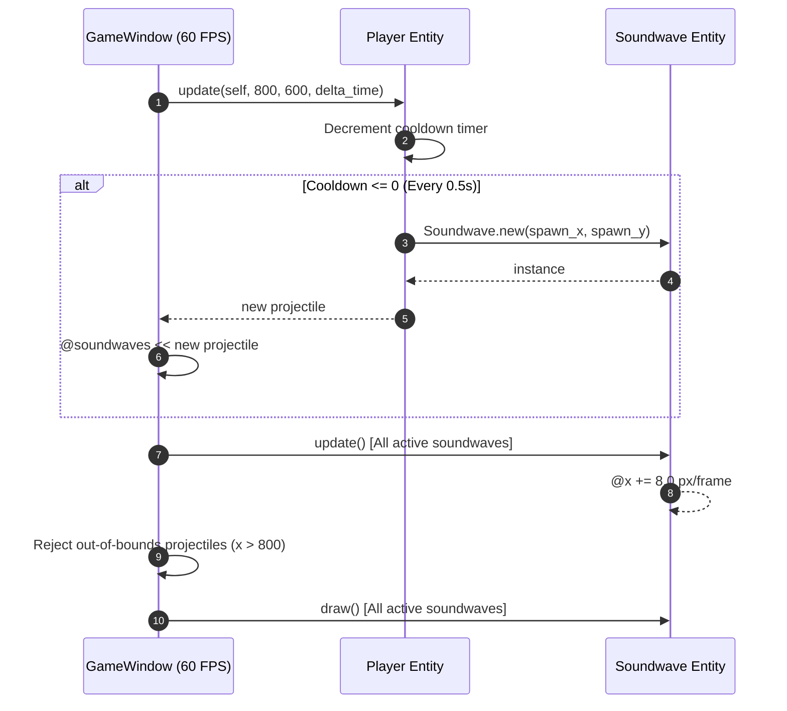

# Technical Specification: Auto-Attack Soundwave Projectile System

## Architectural Overview
The `auto-attack-soundwave` feature implements an automated, periodic projectile system that fires cyan Soundwave projectiles ("โฮ่ง!") to the right every 0.5 seconds (2 shots/sec) from the player's character.

The architecture decouples projectile entity logic (`Soundwave`), weapon cooldown and spawning logic (`Player`), and active projectile lifecycle management and rendering (`GameWindow`).

---

## File Structure & Dependencies

```text
dog-dash-drift/
├── lib/
│   ├── soundwave.rb                # Soundwave projectile entity & boundary detection
│   ├── player.rb                   # Cooldown timer & projectile spawning manager
│   ├── camera.rb                   # Side-scrolling viewport camera
│   └── input_handler.rb            # Directional vector calculation
├── test/
│   ├── test_soundwave.rb           # Unit tests for Soundwave projectile
│   ├── test_player.rb              # Unit tests for auto-attack timer & spawning
│   └── test_camera.rb              # Unit tests for Camera
├── .docs/
│   └── auto-attack-soundwave/
│       ├── requirement.md          # Feature requirements & ACs
│       └── technical.md            # Technical specification (this file)
└── main.rb                         # Game window loop & active projectile manager
```

---

## Component Details

### 1. `Soundwave` (`lib/soundwave.rb`)
- **Constants**: `WIDTH = 16`, `HEIGHT = 8`, `SPEED = 8.0`, `COLOR = Gosu::Color::CYAN`.
- **Attributes**: `@x`, `@y`, `@speed`, `@active`.
- **`update`**: Moves projectile horizontally to the right: `@x += @speed` (8 px/frame).
- **`out_of_bounds?(boundary_width)`**: Returns `true` when `@x > boundary_width` (800 px).
- **`active?`**: Returns `true` if `@active` is true and not out of bounds.

### 2. `Player` (`lib/player.rb`)
- **Attributes**: `@cooldown`, `@fire_rate` (default `0.5` seconds).
- **`update_auto_attack(delta_time)`**: Decrements `@cooldown -= delta_time`. When `@cooldown <= 0`, calls `shoot` to spawn a `Soundwave` entity at `(x + WIDTH, y + HEIGHT/2 - Soundwave::HEIGHT/2)` and resets `@cooldown = @fire_rate`.

### 3. `GameWindow` (`main.rb`)
- **`@soundwaves` Array**: Holds active projectile instances.
- **`update`**:
  1. Invokes `@player.update`, appending any newly spawned `Soundwave` into `@soundwaves`.
  2. Updates all active projectiles (`@soundwaves.each(&:update)`).
  3. Rejects off-screen or inactive projectiles (`@soundwaves.reject! { |sw| sw.out_of_bounds?(width) || !sw.active? }`).

---

## Data Flow Diagram



---

## Verification & Unit Testing

### Automated Unit Tests
Executed via:
```bash
ruby -Ilib:test test/test_player.rb && ruby -Ilib:test test/test_camera.rb && ruby -Ilib:test test/test_soundwave.rb
```
- `TestSoundwave`: Tests rightward motion (8 px/frame), out-of-bounds detection (> 800 px), and manual deactivation.
- `TestPlayer`: Tests auto-attack cooldown timer (0.5s), projectile spawn coordinates, and rate limiting.

### Real Manual Testing Plan
1. **Run Game**:
   ```bash
   bundle exec ruby main.rb
   ```
2. **Observe Firing Rate**: Verify cyan Soundwave projectiles continuously spawn from the Shiba Inu character every 0.5 seconds (2 shots/sec).
3. **Verify Motion**: Confirm projectiles travel to the right at 8 px/frame.
4. **Verify Cleanup**: Observe that projectiles disappear as soon as they cross the right edge of the screen (X > 800).
