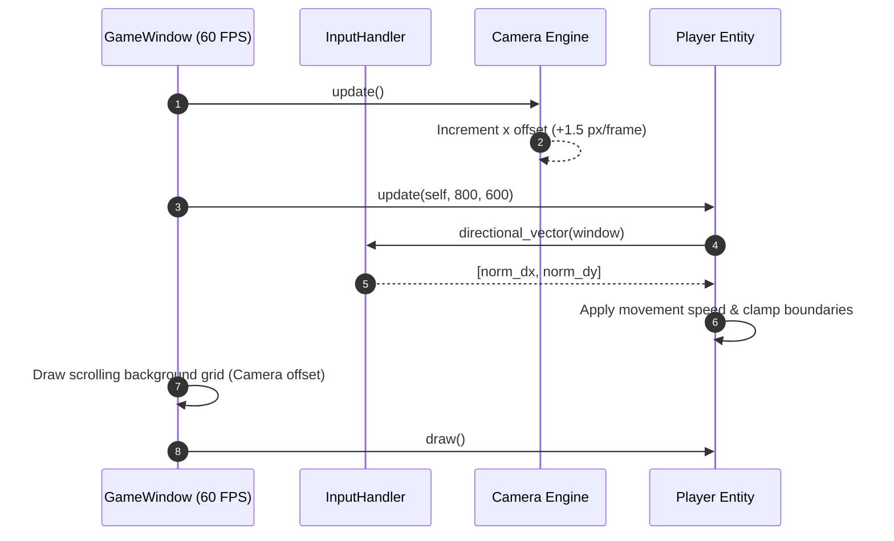

# Technical Specification: Top-Down Free Movement & Side-Scrolling Camera

## Architectural Overview
The `camera-scrolling-movement` feature introduces 8-directional player character movement (W/A/S/D and Arrow Keys), diagonal vector normalization, boundary clamping, and an automatic side-scrolling camera.

The architecture isolates input interpretation (`InputHandler`), viewport scrolling (`Camera`), entity movement (`Player`), and scene rendering (`GameWindow`).

---

## File Structure & Dependencies

```text
dog-dash-drift/
├── lib/
│   ├── camera.rb                   # Side-scrolling camera & world offset
│   ├── input_handler.rb            # Directional input calculation & vector normalization
│   └── player.rb                   # 8-direction movement & boundary clamping
├── test/
│   ├── test_camera.rb              # Unit tests for Camera scrolling
│   └── test_player.rb              # Unit tests for 8-direction movement & clamping
├── .docs/
│   └── camera-scrolling-movement/
│       ├── requirement.md          # Feature requirements & ACs
│       └── technical.md            # Technical specification (this file)
└── main.rb                         # Game window initialization & rendering loop
```

---

## Component Details

### 1. `InputHandler` (`lib/input_handler.rb`)
- **`self.directional_vector(inputs)`**: Inspects `inputs.keyboard.left`, `right`, `up`, `down` or `wasd`. Returns normalized `[dx, dy]`.
- **`self.normalize(dx, dy)`**: Normalizes diagonal movement so diagonal speed matches cardinal speed:
  $$\text{length} = \sqrt{dx^2 + dy^2}$$
  $$\text{norm\_dx} = \frac{dx}{\text{length}}, \quad \text{norm\_dy} = \frac{dy}{\text{length}}$$

### 2. `Camera` (`lib/camera.rb`)
- **Attributes**: `@x` (world horizontal offset), `@scroll_speed` (default `1.5` px/frame).
- **`update`**: Increments `@x += @scroll_speed` each frame to simulate rightward camera progression.

### 3. `Player` (`lib/player.rb`)
- **Attributes**: `@x`, `@y`, `@speed` (default `4.0` px/frame).
- **`update(window, boundary_width, boundary_height)`**: Computes directional vector from `InputHandler`, updates position, and clamps coordinates within screen boundaries (`0..window_width - WIDTH`, `0..window_height - HEIGHT`).

---

## Data Flow Diagram



---

## Verification & Unit Testing

### Automated Unit Tests
Executed via:
```bash
ruby -Ilib:test test/test_player.rb && ruby -Ilib:test test/test_camera.rb
```
- `TestCamera`: Verifies camera initialization and horizontal scrolling rate.
- `TestPlayer`: Verifies cardinal movement, diagonal vector normalization, and boundary clamping.

### Real Manual Testing Plan
1. **Run Game**:
   ```bash
   bundle exec ruby main.rb
   ```
2. **8-Direction Control**: Press W, A, S, D and Arrow keys individually and in diagonal combinations (e.g. W+D). Verify smooth 8-way movement.
3. **Boundary Clamping**: Drive character into top, left, bottom, and right edges. Confirm character stays strictly inside window bounds.
4. **Side-Scrolling Visuals**: Observe the background grid lines scrolling continuously to the left to indicate active forward camera motion.
