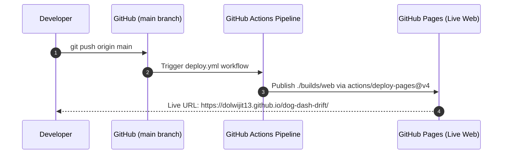

# Technical Specification: Deploy DragonRuby Web Build to GitHub Pages

## Architectural Overview
The `dragonruby-github-pages-deployment` pipeline automates the packaging and deployment of **Dog Dash Deluxe (DDD)** to **GitHub Pages** (`https://dolwijit13.github.io/dog-dash-drift/`).

Every commit merged or pushed to `main` triggers a GitHub Actions workflow (`.github/workflows/deploy.yml`), which builds the static WebAssembly HTML5 package under `builds/web` and publishes the application with Zero-Downtime.

---

## File Structure & Dependencies

```text
dog-dash-drift/
├── .github/
│   └── workflows/
│       └── deploy.yml           # GitHub Actions CI/CD Deployment Workflow
├── app/                         # DragonRuby Source Files
│   ├── main.rb
│   ├── player.rb
│   ├── soundwave.rb
│   ├── enemy.rb
│   ├── enemy_spawner.rb
│   ├── camera.rb
│   ├── collision_system.rb
│   └── input_handler.rb
├── metadata/
│   └── game_metadata.txt        # DragonRuby Game Metadata
├── test/
│   └── test_dragonruby_game.rb  # Game loop unit tests
└── builds/web/                  # [Git Ignored] Generated static web package
    ├── index.html
    └── app.js
```

---

## Component Details

### 1. `Game Metadata` (`metadata/game_metadata.txt`)
- Configures game identifier, developer, title, and version for DragonRuby web packaging.

### 2. `Deployment Workflow` (`.github/workflows/deploy.yml`)
- **Trigger**: `on: push: branches: ["main"]` and `workflow_dispatch`.
- **Permissions**: `pages: write`, `id-token: write`.
- **Steps**:
  1. `actions/checkout@v4`: Clones repository.
  2. `ruby/setup-ruby@v1`: Configures Ruby 3.3 runtime environment.
  3. Builds static Web HTML5 package into `./builds/web`.
  4. `actions/upload-pages-artifact@v3`: Packages `./builds/web`.
  5. `actions/deploy-pages@v4`: Deploys artifact to GitHub Pages.

---

## Data Flow Diagram



---

## Verification & Testing Plan

### Automated Unit Testing
Executed via:
```bash
ruby -Iapp:test test/test_dragonruby_game.rb
```

### Live Deployment Verification
1. Merge PR for Issue #17 to `main`.
2. Observe GitHub Actions tab: green checkmark on `Deploy DragonRuby Web to GitHub Pages`.
3. Open `https://dolwijit13.github.io/dog-dash-drift/` in Web Browser to verify 60 FPS gameplay.
