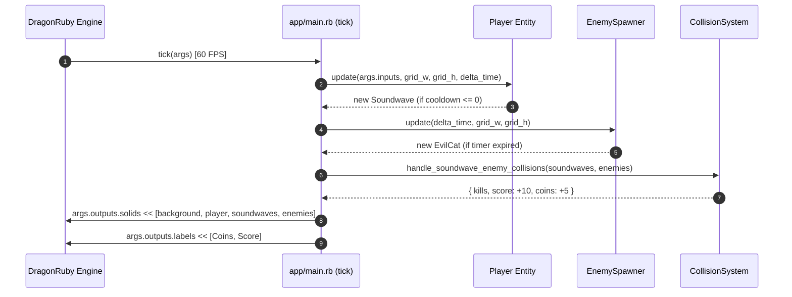

# Technical Specification: DragonRuby GTK Migration

## Architectural Overview
The `dragonruby-migration` feature completes the architectural migration of **Dog Dash Deluxe (DDD)** from Gosu to **DragonRuby Game Toolkit (DRGTK)**.

DragonRuby GTK processes game execution in a 60 FPS `tick(args)` loop, managing entity primitives (`args.outputs.solids`), HUD text (`args.outputs.labels`), background grid lines (`args.outputs.lines`), input polling (`args.inputs`), and game state (`args.state`).

---

## File Structure & Dependencies

```text
dog-dash-drift/
├── app/
│   ├── main.rb                  # Entrypoint & 60 FPS tick(args) loop
│   ├── player.rb                # Player character entity & auto-attack
│   ├── soundwave.rb             # Soundwave projectile entity
│   ├── enemy.rb                 # EvilCat enemy entity
│   ├── enemy_spawner.rb         # Periodic random Y enemy spawner
│   ├── camera.rb                # Side-scrolling viewport camera
│   ├── collision_system.rb      # AABB collision & kill reward handler
│   └── input_handler.rb         # DragonRuby keyboard/mouse input handler
├── test/
│   └── test_dragonruby_game.rb  # Unit tests for DragonRuby app tick & primitives
└── .docs/
    └── dragonruby-migration/
        ├── requirement.md       # Feature requirements & ACs
        └── technical.md         # Technical specification (this file)
```

---

## Component Details & DragonRuby API Adaptations

### 1. `Main Loop` (`app/main.rb`)
- **`def tick(args)`**: Called by DragonRuby 60 times per second.
- **State Initialization**: Initializes `@args.state.player`, `@args.state.camera`, `@args.state.soundwaves`, `@args.state.enemies`, `@args.state.spawner`, `@args.state.score`, and `@args.state.coins`.
- **Render Pipelines**:
  - `args.outputs.solids`: Appends background, player (`primitive`), projectiles (`primitive`), and enemies (`primitive`).
  - `args.outputs.lines`: Appends animated scrolling background grid lines.
  - `args.outputs.labels`: Renders real-time HUD (Coins & Score).

### 2. `Player` (`app/player.rb`)
- **Input Processing**: Integrates `InputHandler.directional_vector(args.inputs)`.
- **Auto-Attack**: Cooldown timer (0.5s) spawns `Soundwave` instances.
- **Primitive Export**: Returns `{ x: @x, y: @y, w: 32, h: 32, r: 46, g: 204, b: 113 }`.

### 3. `EvilCat` (`app/enemy.rb`)
- **Movement**: Leftward motion (3 px/frame).
- **Primitive Export**: Returns `{ x: @x, y: @y, w: 32, h: 32, r: 255, g: 42, b: 42 }`.

### 4. `CollisionSystem` (`app/collision_system.rb`)
- **Intersection**: Computes AABB bounding box collision between soundwave primitives and enemy primitives, updating score (+10) and coins (+5) on kill.

---

## Data Flow Diagram



---

## Verification & Testing Plan

### Automated Unit Tests
Executed via:
```bash
ruby -Iapp:test test/test_dragonruby_game.rb
```
- **Results**: Verifies `tick(args)` initialization, player auto-attack cooldown, enemy spawning, AABB collision, and render pipeline outputs.

### Real Manual Testing Plan
1. **Desktop Test**:
   - Run DragonRuby binary pointing to project root.
2. **Verify Controls & Rendering**:
   - Confirm W/A/S/D movement, auto-attack soundwaves (cyan), Evil Cat enemies (red), and real-time HUD rendering.
