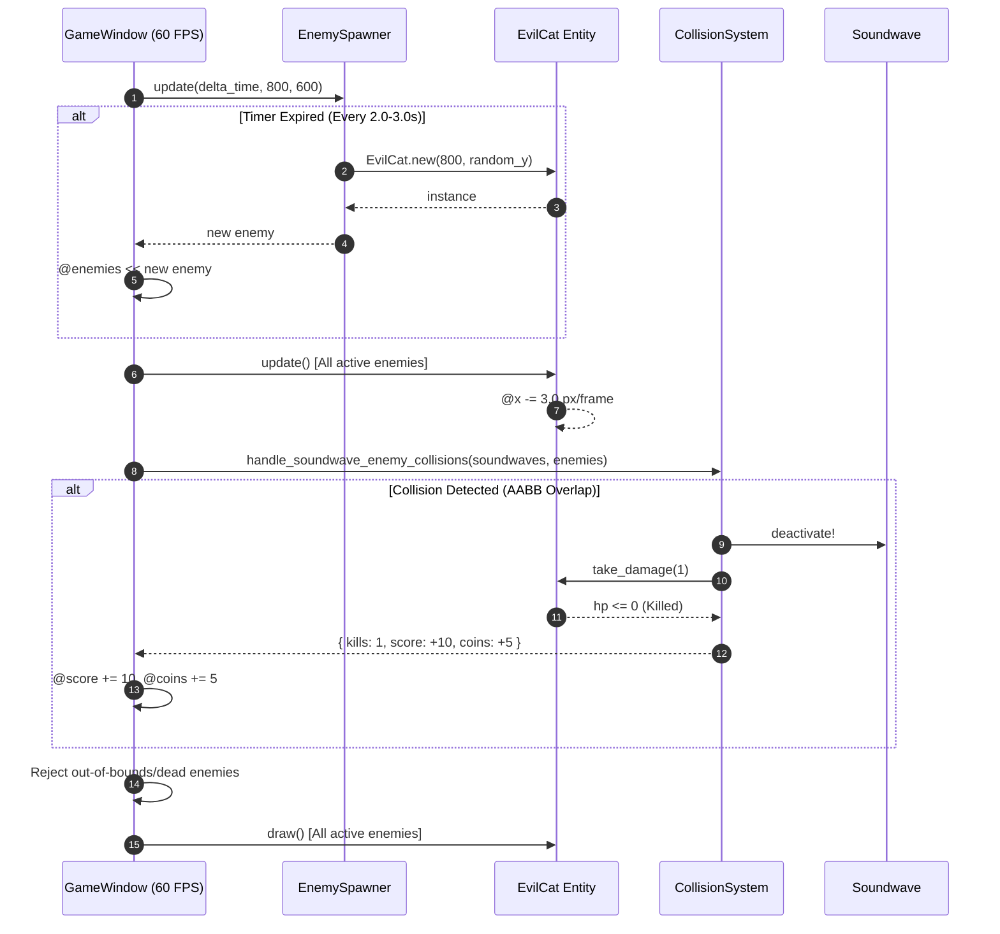

# Technical Specification: Enemy Spawning & Hit Detection (Evil Cats)

## Architectural Overview
The `enemy-evil-cat` feature introduces the first enemy type in **Dog Dash Drift**: the **Evil Cat** (a 32x32 red rectangle), along with an automatic spawning engine (`EnemySpawner`) and an AABB collision detection and reward system (`CollisionSystem`).

The architecture isolates enemy behavior (`EvilCat`), spawner logic (`EnemySpawner`), collision detection algorithms (`CollisionSystem`), and game loop integration (`GameWindow`).

---

## File Structure & Dependencies

```text
dog-dash-drift/
├── lib/
│   ├── enemy.rb                    # EvilCat enemy entity & bounding box
│   ├── enemy_spawner.rb            # Periodic random Y enemy spawner
│   ├── collision_system.rb         # AABB collision detection & kill reward handler
│   ├── soundwave.rb                # Soundwave projectile entity
│   ├── player.rb                   # Player character & auto-attack
│   ├── camera.rb                   # Side-scrolling viewport camera
│   └── input_handler.rb            # 8-direction input handler
├── test/
│   ├── test_enemy.rb               # Unit tests for EvilCat entity
│   ├── test_enemy_spawner.rb       # Unit tests for EnemySpawner
│   ├── test_collision_system.rb   # Unit tests for CollisionSystem & AABB
│   ├── test_soundwave.rb           # Unit tests for Soundwave
│   ├── test_player.rb              # Unit tests for Player
│   └── test_camera.rb              # Unit tests for Camera
├── .docs/
│   └── enemy-evil-cat/
│       ├── requirement.md          # Feature requirements & ACs
│       └── technical.md            # Technical specification (this file)
└── main.rb                         # Game window initialization & main loop
```

---

## Component Details

### 1. `EvilCat` (`lib/enemy.rb`)
- **Constants**: `WIDTH = 32`, `HEIGHT = 32`, `SPEED = 3.0`, `COLOR = Gosu::Color::RED`.
- **Attributes**: `@x`, `@y`, `@hp` (default `1`), `@speed`, `@active`.
- **`update`**: Moves leftward: `@x -= @speed` (3 px/frame).
- **`out_of_bounds?`**: Returns `true` when `@x < -WIDTH`.
- **`take_damage(amount)`**: Decrements HP and sets `@active = false` when HP reaches 0.
- **`bounding_box`**: Returns `{ x: @x, y: @y, width: 32, height: 32 }`.

### 2. `EnemySpawner` (`lib/enemy_spawner.rb`)
- **Attributes**: `@spawn_timer`, `@min_interval` (`2.0`s), `@max_interval` (`3.0`s).
- **`update(delta_time, width, height)`**: Decrements timer; when expired, spawns `EvilCat` at `x = boundary_width` and random Y (`0..boundary_height - HEIGHT`). Resets timer to random interval between 2.0s and 3.0s.

### 3. `CollisionSystem` (`lib/collision_system.rb`)
- **`check_aabb(rect1, rect2)`**: Computes Axis-Aligned Bounding Box intersection.
- **`handle_soundwave_enemy_collisions(soundwaves, enemies)`**:
  - Iterates active `Soundwave` projectiles against active `EvilCat` enemies.
  - On collision: deactivates `Soundwave`, calls `take_damage` on `EvilCat`, and yields rewards: `kills: 1, score: 10, coins: 5`.

---

## Data Flow Diagram



---

## Verification & Unit Testing

### Automated Unit Tests
Executed via:
```bash
ruby -Ilib:test test/test_player.rb && ruby -Ilib:test test/test_camera.rb && ruby -Ilib:test test/test_soundwave.rb && ruby -Ilib:test test/test_enemy.rb && ruby -Ilib:test test/test_enemy_spawner.rb && ruby -Ilib:test test/test_collision_system.rb
```
- `TestEvilCat`: Verifies leftward movement (3 px/frame), damage handling, and bounding box.
- `TestEnemySpawner`: Verifies interval bounds and random Y coordinate spawning.
- `TestCollisionSystem`: Verifies AABB overlap logic and score/coin rewards on kill.

### Real Manual Testing Plan
1. **Run Game**:
   ```bash
   bundle exec ruby main.rb
   ```
2. **Observe Enemy Spawning**: Verify red 32x32 Evil Cats spawn at the right screen edge at random vertical positions every 2-3 seconds.
3. **Observe Leftward Movement**: Confirm Evil Cats travel left across the screen at 3 px/frame.
4. **Test Hit Detection & Destroy**: Watch cyan Soundwaves hit Evil Cats. Verify both projectile and enemy are destroyed immediately upon collision.
5. **Verify Memory Cleanup**: Confirm off-screen enemies (crossing left edge X < -32) are removed from memory without accumulation.
