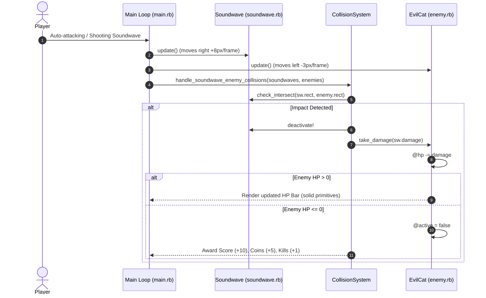

# 🐱 Monster Health Pool & Damage System — Technical Specification

## 🏗️ Architectural Overview & File Structure

This feature extends the enemy entity lifecycle in DragonRuby GTK, replacing single-hit deactivation with a scalable Health Pool (HP) system, dynamic visual feedback (HP Bar), and configurable weapon damage scaling.

```text
app/
├── enemy.rb             # EvilCat class with @hp, @max_hp, take_damage, and hp_bar_primitives
├── soundwave.rb         # Soundwave projectile class with @damage attribute
├── collision_system.rb  # Soundwave-Enemy collision handling using sw.damage and hp <= 0 checks
└── main.rb              # Main tick loop rendering enemy primitives and hp_bar_primitives
```

---

## 🧩 Component Details

### 1. `EvilCat` (`app/enemy.rb`)
- **Constants**: `WIDTH = 32`, `HEIGHT = 32`, `SPEED = 3.0`, `DEFAULT_HP = 25`
- **Attributes**: `x`, `y`, `hp`, `max_hp`, `speed`, `active`
- **Methods**:
  - `initialize(x = 1280, y = 344, hp = DEFAULT_HP, speed = SPEED)`: Initializes position, HP pool, max HP, and active state.
  - `take_damage(amount)`: Reduces `@hp` by `amount`. Sets `@hp = 0` and `@active = false` if `@hp <= 0`.
  - `hp_bar_primitives`: Returns array of DragonRuby solid primitive hashes (Background Red & Foreground Green bars) rendered above the enemy when `@hp < @max_hp`.
  - `active?`: Returns true if active, in bounds, and `@hp > 0`.

### 2. `Soundwave` (`app/soundwave.rb`)
- **Constants**: `DEFAULT_DAMAGE = 10`
- **Attributes**: `x`, `y`, `speed`, `active`, `damage`
- **Methods**:
  - `initialize(x, y, speed = SPEED, damage = DEFAULT_DAMAGE)`: Stores weapon damage.

### 3. `CollisionSystem` (`app/collision_system.rb`)
- **Method**: `self.handle_soundwave_enemy_collisions(soundwaves, enemies)`
  - Deactivates bullet on impact.
  - Applies `sw.damage` (default 10) to `enemy.take_damage(damage)`.
  - Awards kills (+1), score (+10), coins (+5), and collectible drop chance (30%) ONLY when `enemy.hp <= 0`.

---

## 🔄 Data Flow Sequence Diagram



---

## 🧪 Unit Test Results & Verification

### Unit Test Execution
Automated unit tests were executed with Minitest:
```bash
ruby -I. -Iapp -e "Dir['test/test_*.rb'].each { |f| require_relative f }"
```

**Results:**
`24 runs, 127 assertions, 0 failures, 0 errors, 0 skips`

### Real Manual Testing Steps (วิธีการทดสอบเล่นจริง)
1. Launch game via DragonRuby GTK (`./dragonruby .`) or open Web Build on Browser.
2. Observe EvilCat spawning from the right screen boundary.
3. Fire first Soundwave bullet at EvilCat (Damage: 10).
   - Verify bullet deactivates on hit.
   - Verify EvilCat survives (HP reduced from 25 to 15).
   - Verify small green/red HP bar appears directly above the EvilCat.
4. Fire second Soundwave bullet at EvilCat (Damage: 10).
   - Verify HP bar drops to ~20% width (HP: 5/25).
5. Fire third Soundwave bullet at EvilCat (Damage: 10).
   - Verify EvilCat disintegrates/vanishes.
   - Verify score (+10) and coins (+5) are awarded upon death.
