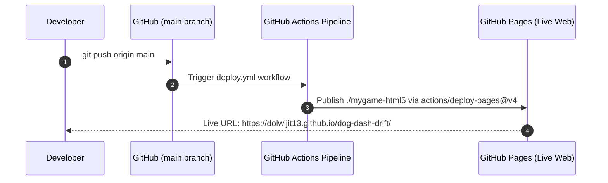

# Technical Specification: GitHub Pages Deployment Pipeline

## Architectural Overview
The `github-pages-deployment` pipeline automates the publication of **Dog Dash Deluxe (DDD)** to **GitHub Pages** (`https://dolwijit13.github.io/dog-dash-drift/`).

Every commit merged or pushed to `main` triggers the GitHub Actions workflow (`.github/workflows/deploy.yml`), which deploys DragonRuby's native WebAssembly HTML5 export directory (`./mygame-html5`) directly to GitHub Pages with Zero-Downtime.

---

## File Structure & Dependencies

```text
dog-dash-drift/
├── .github/
│   └── workflows/
│       └── deploy.yml           # GitHub Actions CI/CD Deployment Workflow
├── app/                         # DragonRuby Source Files
│   ├── main.rb
│   ├── player.rb
│   ├── soundwave.rb
│   ├── enemy.rb
│   ├── enemy_spawner.rb
│   ├── camera.rb
│   ├── collision_system.rb
│   └── input_handler.rb
├── test/
│   └── test_dragonruby_game.rb  # Game loop unit tests
└── mygame-html5/                # Native DragonRuby HTML5 WebAssembly Export
    ├── index.html
    ├── dragonruby.js
    └── dragonruby.wasm
```

---

## Component Details

### 1. `Deployment Workflow` (`.github/workflows/deploy.yml`)
- **Trigger**: `on: push: branches: ["main"]` and `workflow_dispatch`.
- **Permissions**: `pages: write`, `id-token: write`.
- **Steps**:
  1. `actions/checkout@v4`: Clones repository.
  2. `actions/configure-pages@v5`: Configures GitHub Pages metadata.
  3. `actions/upload-pages-artifact@v3`: Packages DragonRuby native `./mygame-html5` build directory.
  4. `actions/deploy-pages@v4`: Deploys artifact to GitHub Pages.

---

## Data Flow Diagram



---

## Verification & Testing Plan

### Automated Unit Testing
Executed via:
```bash
ruby -Iapp:test test/test_dragonruby_game.rb
```

### Live Deployment Verification
1. Merge PR #13 to `main`.
2. Observe GitHub Actions tab: green checkmark on `Deploy to GitHub Pages`.
3. Open `https://dolwijit13.github.io/dog-dash-drift/` in Web Browser to verify 60 FPS gameplay.
