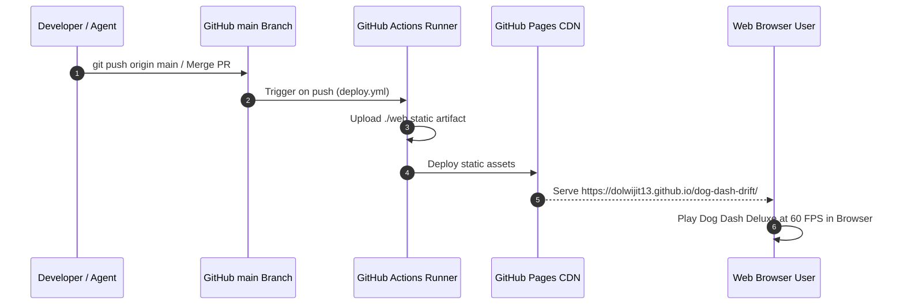

# Technical Specification: Web Build & GitHub Pages Deployment Pipeline

## Architectural Overview
The `github-pages-deployment` feature provides an automated CI/CD pipeline and web engine runner for **Dog Dash Deluxe (DDD)**.

It compiles static web artifacts (`web/index.html`, `web/game.js`) mirroring Gosu 2D game mechanics into an HTML5 Canvas Interoperability Layer and deploys them to GitHub Pages (`https://dolwijit13.github.io/dog-dash-drift/`) via GitHub Actions.

---

## File Structure & Dependencies

```text
dog-dash-drift/
├── .github/
│   └── workflows/
│       └── deploy.yml              # Automated GitHub Pages CI/CD workflow
├── web/
│   ├── index.html                  # Responsive Web Runner container & canvas
│   └── game.js                     # Gosu 2D HTML5 Canvas engine adapter
├── test/
│   └── test_web_build.rb           # Unit tests for Web build & CI configuration
├── .docs/
│   └── github-pages-deployment/
│       ├── requirement.md          # Feature requirements & ACs
│       └── technical.md            # Technical specification (this file)
└── README.md                       # Project overview with live demo badge
```

---

## Component Details

### 1. `Web Engine Adapter` (`web/index.html` & `web/game.js`)
- **HTML Container**: Renders a centered, styled `#gameCanvas` (`800x600` px) with keyboard and mouse control hints.
- **Engine Adapter**:
  - `Player`: Handles W/A/S/D and Arrow Keys, 8-direction movement, diagonal vector normalization, boundary clamping, and 0.5s auto-attack firing rate.
  - `Camera`: Handles side-scrolling offset (`1.5` px/frame) and grid line rendering.
  - `Soundwave`: Projectile entity moving rightward (`8.0` px/frame) with canvas cleanup (`x > 800`).
  - `EvilCat`: Red 32x32 enemy entity moving leftward (`3.0` px/frame) spawned randomly every 2-3 seconds.
  - `CollisionSystem`: Computes AABB bounding box intersections, awarding +10 Score & +5 Coins on enemy kills.

### 2. `GitHub Actions CI/CD Pipeline` (`.github/workflows/deploy.yml`)
- **Trigger**: Pushes to `main` branch or manual `workflow_dispatch`.
- **Permissions**: `pages: write`, `id-token: write`.
- **Workflow Steps**:
  1. `actions/checkout@v4`: Checks out source files.
  2. `actions/configure-pages@v5`: Prepares GitHub Pages environment.
  3. `actions/upload-pages-artifact@v3`: Packages `./web` static assets.
  4. `actions/deploy-pages@v4`: Deploys to `https://dolwijit13.github.io/dog-dash-drift/`.

---

## Data Flow & Deployment Diagram



---

## Verification & Testing Plan

### Automated Unit Tests
Executed via:
```bash
ruby -Ilib:test test/test_web_build.rb
```
- `TestWebBuild`: Verifies existence and content integrity of `index.html`, `game.js`, and `.github/workflows/deploy.yml`.

### Real Manual Testing Plan
1. **GitHub Actions Execution**:
   - Check [Actions tab on GitHub](https://github.com/dolwijit13/dog-dash-drift/actions).
   - Confirm `Deploy to GitHub Pages` workflow completes with a green checkmark.
2. **Web Browser Verification**:
   - Navigate to `https://dolwijit13.github.io/dog-dash-drift/`.
   - Verify that the canvas renders cleanly at 60 FPS and that keyboard controls (W/A/S/D) and auto-attacks operate smoothly without errors.
