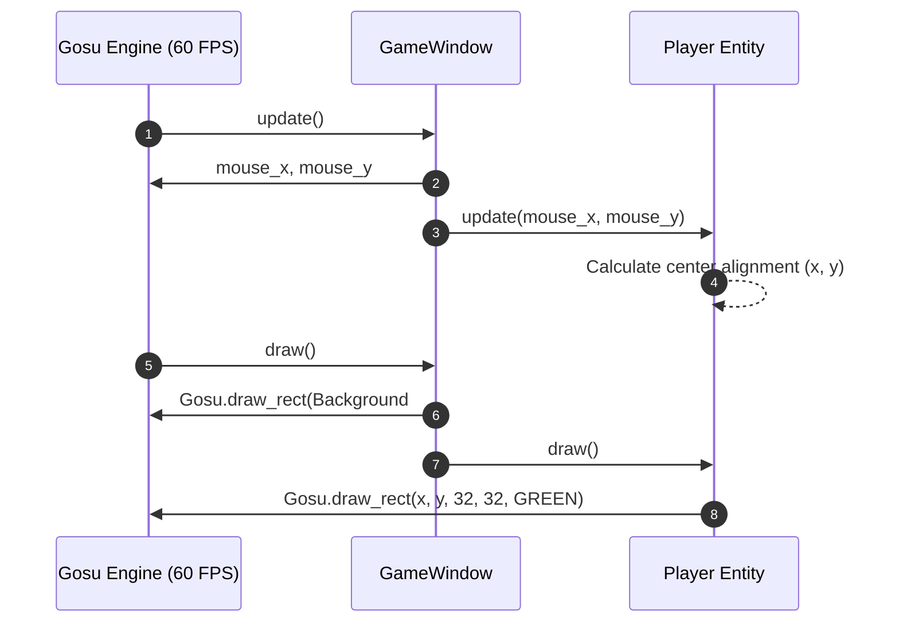

# Technical Specification: Player Mouse Movement

## Architectural Overview
The `player-mouse-movement` feature implements the fundamental entity and input-tracking system for the player character in **Dog Dash Drift**.

The architecture decouples window management (`GameWindow`) from player entity logic (`Player`), preparing the codebase for modular growth.

---

## File Structure & Dependencies

```text
dog-dash-drift/
├── lib/
│   └── player.rb          # Player entity logic, dimensions, and drawing
├── .docs/
│   └── player-mouse-movement/
│       ├── requirement.md # Feature requirement & acceptance criteria
│       └── technical.md   # Technical implementation design (this file)
└── main.rb                # Game window initialization and main loop
```

---

## Component Details

### 1. `Player` (`lib/player.rb`)
Encapsulates player character parameters, movement calculation, and rendering.

* **Constants**:
  * `WIDTH = 32`: Rectangle width in pixels.
  * `HEIGHT = 32`: Rectangle height in pixels.
  * `COLOR = Gosu::Color::GREEN`: Render color.
* **Attributes**:
  * `@x`, `@y` (`attr_reader :x, :y`): Current top-left rendering coordinates.
* **Methods**:
  * `initialize(x = 0, y = 0)`: Sets initial coordinates.
  * `update(mouse_x, mouse_y)`: Calculates top-left position such that the center of the 32x32 rectangle aligns directly with the mouse pointer:
    $$\text{draw\_x} = \text{mouse\_x} - \frac{\text{WIDTH}}{2}$$
    $$\text{draw\_y} = \text{mouse\_y} - \frac{\text{HEIGHT}}{2}$$
  * `draw`: Renders rectangle via `Gosu.draw_rect(@x, @y, WIDTH, HEIGHT, COLOR)`.

### 2. `GameWindow` (`main.rb`)
Inherits from `Gosu::Window` (800x600 resolution at 60 FPS).

* **Methods**:
  * `initialize`: Sets window size, title (`Dog Dash Drift`), and instantiates `Player.new`.
  * `update`: Invokes `@player.update(mouse_x, mouse_y)` each frame.
  * `draw`: Clears background with Catppuccin Macchiato Base (`0xff_1e1e2e`) and calls `@player.draw`.
  * `needs_cursor?`: Returns `true` to ensure system mouse pointer remains visible.
  * `button_down(id)`: Listens for `Gosu.KB_ESCAPE` to execute `close`.

---

## Data Flow Diagram



---

## Verification & Manual Testing Plan

1. **Execution**:
   ```bash
   bundle exec ruby main.rb
   ```
2. **Mouse Movement Verification**:
   * Move the mouse across the 800x600 window.
   * Verify that the green 32x32 pixel square smoothly tracks the cursor in real time without lag or offset errors.
3. **Clean Exit Verification**:
   * Press `ESC` on the keyboard.
   * Verify that the window closes immediately with return code 0 and no stack traces or errors.
