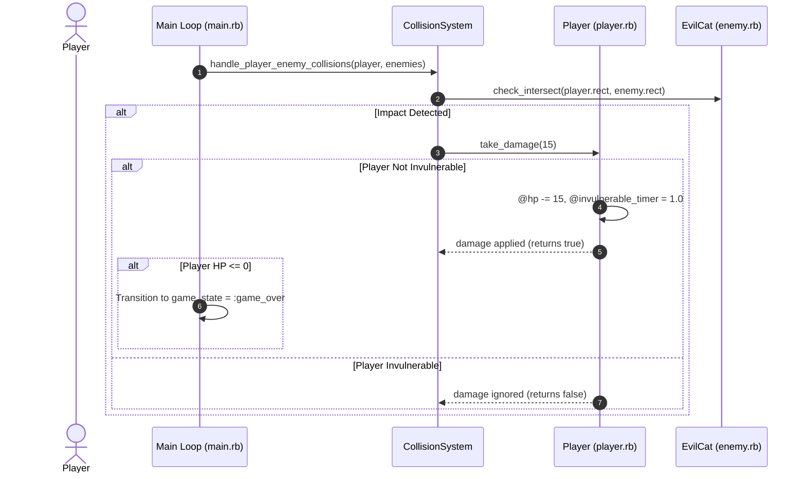

# 🐕 Player Stat Upgrade & Health System — Technical Specification

## 🏗️ Architectural Overview & File Structure

This feature introduces Player Health (HP & Max HP), Invulnerability Frames, Player Stat Upgrades (Max HP, Move Speed, Base Damage), Player-Enemy damage collision handling, HUD HP Bar rendering, and Game Over state handling with restarting mechanics.

```text
app/
├── player.rb            # Player class with HP, Max HP, stat upgrade levels, damage, and invulnerability
├── collision_system.rb  # Player-Enemy and Player-Obstacle damage handling
└── main.rb              # Game loop with :playing / :game_over state machine, HP HUD bar, and Game Over overlay
```

---

## 🧩 Component Details

### 1. `Player` (`app/player.rb`)
- **Constants**: `DEFAULT_MAX_HP = 100`, `DEFAULT_BASE_DAMAGE = 10`
- **Attributes**: `hp`, `max_hp`, `hp_level`, `move_speed_level`, `damage_level`, `base_damage`, `invulnerable_timer`
- **Methods**:
  - `initialize(...)`: Initializes HP (100), Max HP (100), Base Damage (10), upgrade levels (1), and invulnerable timer (0.0).
  - `take_damage(amount = 10)`: Returns `false` if `invulnerable?`. Otherwise reduces `@hp`, sets `@hp = 0` if below zero, triggers 1.0s invulnerability frame (`@invulnerable_timer = 1.0`), and returns `true`.
  - `invulnerable?`: Returns true if `@invulnerable_timer > 0`.
  - `upgrade_max_hp(amount = 25)`: Increases `@hp_level` (+1), `@max_hp` (+25), and heals `@hp` (+25).
  - `upgrade_speed(amount = 0.5)`: Increases `@move_speed_level` (+1) and `@base_speed` (+0.5).
  - `upgrade_damage(amount = 5)`: Increases `@damage_level` (+1) and `@base_damage` (+5).
  - `primitive`: Returns solid hash primitive; flashes white during invulnerability frames.

### 2. `CollisionSystem` (`app/collision_system.rb`)
- **Methods**:
  - `self.handle_player_enemy_collisions(player, enemies)`: Applies 15 damage to player on enemy contact.
  - `self.handle_player_obstacle_collisions(player, obstacles)`: Applies 10 damage to player on obstacle contact alongside slowdown and coin penalty.

### 3. `Game Loop & State Machine` (`app/main.rb`)
- **State Machine**: `args.state.game_state ||= :playing`
  - `:playing`: Updates movement, camera, auto-attack, enemy collisions, obstacle collisions, and checks if `player.hp <= 0` to transition to `:game_over`.
  - `:game_over`: Renders translucent dark overlay, "GAME OVER" label, final score/coins summary, and listens for `ESC` or `R` key to restart game state.
- **HUD HP Bar**: Renders solid background rect (red) and foreground rect (green) at `x: 30, y: hud_y_top - 65, w: 200, h: 16`.

---

## 🔄 Data Flow Sequence Diagram



---

## 🧪 Unit Test Results & Verification

### Unit Test Execution
Automated unit tests were executed with Minitest:
```bash
ruby -I. -Iapp -e "Dir['test/test_*.rb'].each { |f| require_relative f }"
```

**Results:**
`30 runs, 158 assertions, 0 failures, 0 errors, 0 skips`

### Real Manual Testing Steps (วิธีการทดสอบเล่นจริง)
1. Launch game via DragonRuby GTK (`./dragonruby .`) or open Web Build on Browser.
2. Observe HUD on top left: verify `HP: 100/100` and green HP bar.
3. Move player into EvilCat (enemy):
   - Verify player receives damage (-15 HP -> 85/100).
   - Verify green HP bar shrinks proportionally.
   - Verify player sprite flashes white for 1 second (Invulnerability Frame).
   - Verify colliding with enemies during invulnerability causes no additional HP loss.
4. Move player into Broccoli (obstacle):
   - Verify player receives damage (-10 HP) and slowdown effect.
5. Allow player HP to reach 0:
   - Verify game transitions to **GAME OVER** screen with dark translucent background.
   - Verify "GAME OVER", final score, and final coins are displayed.
   - Press **R** or **ESC** key -> verify game resets to playing state with 100 HP.
