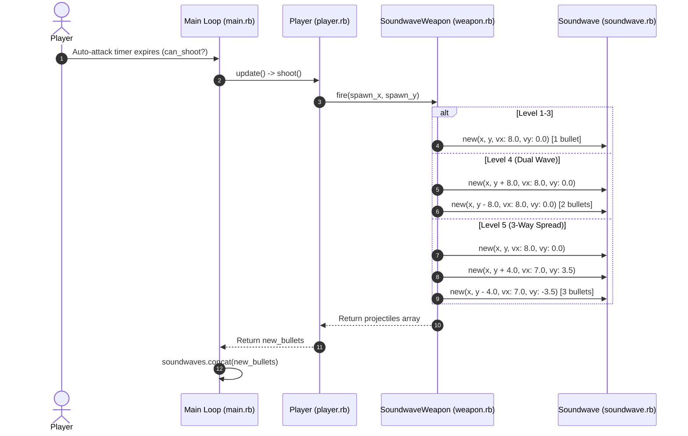

# 🔊 Modular Soundwave Weapon Upgrade System — Technical Specification

## 🏗️ Architectural Overview & File Structure

This feature introduces an extensible, modular weapon system (`Weapon` base class and `SoundwaveWeapon` concrete subclass), supporting weapon level progressions (Levels 1 to 5), multi-projectile firing patterns (Dual Wave & 3-Way Spread Wave), dynamic velocity vectors (`vx`, `vy`), bullet size scaling, damage scaling, and upgrade cost scaling.

```text
app/
├── weapon.rb            # Weapon base class and SoundwaveWeapon modular weapon subclass (Levels 1-5)
├── soundwave.rb         # Soundwave projectile class with velocity vector (vx, vy) and dynamic size (w, h)
├── player.rb            # Player class integrated with SoundwaveWeapon
└── main.rb              # Main tick loop supporting multi-projectile firing and update array concatenation
```

---

## 🧩 Component Details

### 1. `Weapon` Base & `SoundwaveWeapon` (`app/weapon.rb`)
- **Base `Weapon`**:
  - Attributes: `name`, `level`, `max_level`
  - Constants: `UPGRADE_COSTS = [50, 100, 200, 350]`
  - Methods: `can_upgrade?`, `upgrade_cost`, `upgrade!`, `fire(spawn_x, spawn_y)`
- **`SoundwaveWeapon` (Subclass)**:
  - Attributes: `cooldown`, `damage`, `w`, `h`, `speed`, `projectile_count`
  - **Level Progressions**:
    - **Level 1**: Cooldown = 0.5s, Damage = 10, Size = 16x8, 1 projectile (`vx: 8.0, vy: 0.0`)
    - **Level 2**: Cooldown = 0.375s (-25%), Damage = 10, Size = 16x8, 1 projectile (`vx: 8.0, vy: 0.0`)
    - **Level 3**: Cooldown = 0.375s, Damage = 15 (+50%), Size = 24x12 (+50%), 1 projectile (`vx: 8.0, vy: 0.0`)
    - **Level 4**: Cooldown = 0.375s, Damage = 15, Size = 24x12, 2 parallel projectiles (Dual Wave: offsets `+8.0` & `-8.0`)
    - **Level 5**: Cooldown = 0.375s, Damage = 15, Size = 24x12, 3 spread projectiles (3-Way Spread: straight `vx: 8, vy: 0`, angled up `vx: 7, vy: 3.5`, angled down `vx: 7, vy: -3.5`)

### 2. `Soundwave` (`app/soundwave.rb`)
- **Attributes**: `x`, `y`, `vx`, `vy`, `speed`, `damage`, `w`, `h`, `active`
- **Methods**:
  - `initialize(x, y, vx_or_speed, vy_or_damage, damage, w, h)`: Supports both legacy parameters and velocity vector / dynamic dimensions parameters.
  - `update`: Moves bullet by `@x += @vx` and `@y += @vy`.
  - `out_of_bounds?`: Detects boundary exit on top, bottom, or right.

### 3. `Player` & Main Loop Integration (`app/player.rb` & `app/main.rb`)
- `Player`: Holds `@weapon = SoundwaveWeapon.new(1)`. Delegate `fire_rate` to `@weapon.cooldown`.
- `shoot`: Returns array of `Soundwave` projectiles generated by `@weapon.fire(...)`.
- `main.rb`: Appends array of bullets returned from `player.update` using `args.state.soundwaves.concat(Array(new_bullets))`.

---

## 🔄 Data Flow Sequence Diagram



---

## 🧪 Unit Test Results & Verification

### Unit Test Execution
Automated unit tests were executed with Minitest:
```bash
ruby -I. -Iapp -e "Dir['test/test_*.rb'].each { |f| require_relative f }"
```

**Results:**
`36 runs, 213 assertions, 0 failures, 0 errors, 0 skips`

### Real Manual Testing Steps (วิธีการทดสอบเล่นจริง)
1. Launch game via DragonRuby GTK (`./dragonruby .`) or open Web Build on Browser.
2. **Level 1**: Observe Soundwave firing 1 bullet straight right (Cooldown: 0.5s, Damage: 10, Size: 16x8).
3. **Upgrade to Level 2**: Observe firing rate speedup (Cooldown: 0.375s).
4. **Upgrade to Level 3**: Observe larger Soundwave bullet (24x12) dealing increased damage (15 Damage - destroys 25 HP EvilCat in 2 hits instead of 3).
5. **Upgrade to Level 4**: Observe Dual Soundwave waves firing simultaneously from top and bottom offsets.
6. **Upgrade to Level 5**: Observe 3-Way Spread Soundwave firing straight right, angled up, and angled down, sweeping across enemies.
