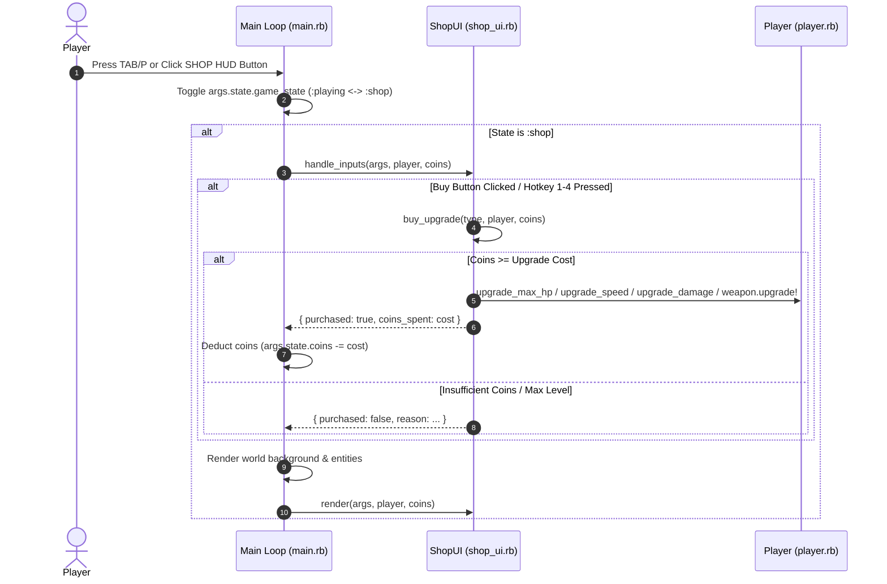

# 🛒 In-Game Shop & Upgrade Overlay UI — Technical Specification

## 🏗️ Architectural Overview & File Structure

This feature implements an in-game Shop Overlay UI (`ShopUI`) enabling players to toggle an interactive shop menu during gameplay via `TAB`, `P`, `ESC`, or by clicking the `[SHOP (TAB/P)]` HUD button. When the shop opens, the game state transitions to `:shop`, pausing all background gameplay updates (movement, enemy spawning, collision detection) while preserving background rendering and rendering the interactive upgrade overlay panel.

```text
app/
├── shop_ui.rb           # Shop UI Manager & Overlay renderer (button rects, costs, input handling)
├── main.rb              # Game tick loop handling :shop state transition, pause logic, and HUD shop button
└── player.rb & weapon.rb# Stat upgrade methods (Max HP, Move Speed, Base Damage, Soundwave Weapon Level)
```

---

## 🧩 Component Details

### 1. `ShopUI` Class (`app/shop_ui.rb`)
- **Constants**: `WIDTH = 640`, `HEIGHT = 440`
- **Methods**:
  - `upgrade_costs(player)`: Calculates current upgrade costs:
    - Max HP: `50 * player.hp_level`
    - Move Speed: `40 * player.move_speed_level`
    - Base Damage: `60 * player.damage_level`
    - Soundwave Weapon: `player.weapon.upgrade_cost`
  - `button_rects(origin_x, origin_y)`: Computes bounding boxes for 4 upgrade buttons inside modal.
  - `buy_upgrade(type, player, coins)`: Validates coin balance, performs upgrade, and returns `{ success: true, coins_spent: cost }`.
  - `handle_inputs(args, player, coins)`: Listens for keyboard shortcuts (1-4) or mouse click intersection with button rects.
  - `render(args, player, coins)`: Draws dark overlay, modal container, headers, option button boxes (green when affordable, gray when unaffordable), labels, and keyboard instructions.

### 2. State & Pause Management (`app/main.rb`)
- **States**: `:playing`, `:shop`, `:game_over`.
- **Toggle Logic**: Triggers on `TAB` key, `P` key, or mouse click inside HUD `[SHOP (TAB/P)]` button (`x: grid_w - 200, y: grid_h - 45, w: 170, h: 35`).
- **Pause behavior**: When `game_state == :shop`, entity updates (`player`, `enemies`, `soundwaves`, `obstacles`, `collectibles`) are paused, while rendering pipeline and shop input handlers remain active.

---

## 🔄 Data Flow Sequence Diagram



---

## 🧪 Unit Test Results & Verification

### Unit Test Execution
Automated unit tests were executed with Minitest:
```bash
ruby -I. -Iapp -e "Dir['test/test_*.rb'].each { |f| require_relative f }"
```

**Results:**
`43 runs, 241 assertions, 0 failures, 0 errors, 0 skips`

### Real Manual Testing Steps (วิธีการทดสอบเล่นจริง)
1. Launch game via DragonRuby GTK (`./dragonruby .`) or open Web Build on Browser.
2. During gameplay, press **TAB** or **P** or click the **SHOP (TAB/P)** purple button at top right HUD.
3. Observe that game updates (enemies and background movement) pause immediately.
4. Review current coins and 4 upgrade options:
   - Option 1: Max HP (+25)
   - Option 2: Move Speed (+0.5)
   - Option 3: Base Damage (+5)
   - Option 4: Soundwave Weapon (Levels 1-5)
5. Press key **1**, **2**, **3**, or **4** or click button with mouse to buy an upgrade.
6. Verify coins are deducted, level increases, and button updates status.
7. Press **TAB**, **P**, or **ESC** to close shop and resume gameplay.
